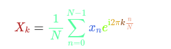

# x11 Color Names in Mathjax

adding the code below in the `<head>` section makes it possible to use all [x11 colors](https://en.wikipedia.org/wiki/X11_color_names) in [MathJax](https://www.mathjax.org/) formulas.

If you wonder why this is useful, have a look at [this nice blogpost](https://betterexplained.com/articles/colorized-math-equations/) by [@kazad](https://github.com/kazad) that contains several nice examples how colorized math equations can help. 

A project that uses this code is the [Physics Travel Guide](https://physicstravelguide.com/).

  **Example**

```
$$ \color{firebrick} X_{\color{freq} k} \color{black} = \color{seagreen} \frac{1}{N} \sum_{n=0}^{N-1} \color{royalblue}x_n \color{chartreuse} e^{\mathrm{i} \color{goldenrod} 2\pi \color{saddlebrown}k \color{darksalmon} \frac{n}{N}} $$
```

renders to 



**Code**

```

<script type="text/x-mathjax-config">/*<![CDATA[*/MathJax.Hub.Config({
    TeX: {
        extensions: ["color.js"]
    }
});
MathJax.Hub.Register.StartupHook("TeX color Ready", function() {

MathJax.Extension["TeX/color"].colors["aliceblue"] = '#f0f8ff';
MathJax.Extension["TeX/color"].colors["antiquewhite"] = '#faebd7';
MathJax.Extension["TeX/color"].colors["aquamarine"] = '#7fffd4';
MathJax.Extension["TeX/color"].colors["azure"] = '#f0ffff';
MathJax.Extension["TeX/color"].colors["beige"] = '#f5f5dc';
MathJax.Extension["TeX/color"].colors["bisque"] = '#002A22';
MathJax.Extension["TeX/color"].colors["blanchedalmond"] = '#ffe4c4';
MathJax.Extension["TeX/color"].colors["blueviolet"] = '#ffebcd';
MathJax.Extension["TeX/color"].colors["brown"] = '#8a2be2';
MathJax.Extension["TeX/color"].colors["burlywood"] = '#deb887';
MathJax.Extension["TeX/color"].colors["cadetblue"] = '#5f9ea0';
MathJax.Extension["TeX/color"].colors["chartreuse"] = '#7fff00';
MathJax.Extension["TeX/color"].colors["chocolate"] = '#d2691e';
MathJax.Extension["TeX/color"].colors["coral"] = '#ff7f50';
MathJax.Extension["TeX/color"].colors["cornflowerblue"] = '#6495ed';
MathJax.Extension["TeX/color"].colors["cornsilk"] = '#fff8dc';
MathJax.Extension["TeX/color"].colors["darkgoldenrod"] = '#b8860b';
MathJax.Extension["TeX/color"].colors["darkgreen"] = '#006400';
MathJax.Extension["TeX/color"].colors["darkkhaki"] = '#bdb76b';
MathJax.Extension["TeX/color"].colors["darkolivegreen"] = '#556b2f';
MathJax.Extension["TeX/color"].colors["darkorange"] = '#ff8c00';
MathJax.Extension["TeX/color"].colors["darkorchid"] = '#9932cc';
MathJax.Extension["TeX/color"].colors["darksalmon"] = '#e9967a';
MathJax.Extension["TeX/color"].colors["darkseagreen"] = '#002A22';
MathJax.Extension["TeX/color"].colors["darkslateblue"] = '#483d8b';
MathJax.Extension["TeX/color"].colors["darkslategray"] = '#2f4f4f';
MathJax.Extension["TeX/color"].colors["darkturquoise"] = '#00ced1';
MathJax.Extension["TeX/color"].colors["darkviolet"] = '#9400d3';
MathJax.Extension["TeX/color"].colors["deeppink"] = '#ff1493';
MathJax.Extension["TeX/color"].colors["deepskyblue"] = '#00bfff';
MathJax.Extension["TeX/color"].colors["dimgray"] = '#696969';
MathJax.Extension["TeX/color"].colors["dodgerblue"] = '#1e90ff';
MathJax.Extension["TeX/color"].colors["firebrick"] = '#b22222';
MathJax.Extension["TeX/color"].colors["floralwhite"] = '#fffaf0';
MathJax.Extension["TeX/color"].colors["forestgreen"] = '#228b22';
MathJax.Extension["TeX/color"].colors["gainsboro"] = '#dcdcdc';
MathJax.Extension["TeX/color"].colors["ghostwhite"] = '#f8f8ff';
MathJax.Extension["TeX/color"].colors["gold"] = '#ffd700';
MathJax.Extension["TeX/color"].colors["goldenrod"] = '#daa520';
MathJax.Extension["TeX/color"].colors["gray"] = '#bebebe';
MathJax.Extension["TeX/color"].colors["green"] = '#00ff00';
MathJax.Extension["TeX/color"].colors["greenyellow"] = '#adff2f';
MathJax.Extension["TeX/color"].colors["honeydew"] = '#f0fff0';
MathJax.Extension["TeX/color"].colors["hotpink"] = '#ff69b4';
MathJax.Extension["TeX/color"].colors["indianred"] = '#cd5c5c';
MathJax.Extension["TeX/color"].colors["ivory"] = '#fffff0';
MathJax.Extension["TeX/color"].colors["khaki"] = '#f0e68c';
MathJax.Extension["TeX/color"].colors["lavender"] = '#e6e6fa';
MathJax.Extension["TeX/color"].colors["lavenderblush"] = '#fff0f5';
MathJax.Extension["TeX/color"].colors["lawngreen"] = '#7cfc00';
MathJax.Extension["TeX/color"].colors["lemonchiffon"] = '#fffacd';
MathJax.Extension["TeX/color"].colors["light"] = '#eedd82';
MathJax.Extension["TeX/color"].colors["lightblue"] = '#add8e6';
MathJax.Extension["TeX/color"].colors["lightcoral"] = '#f08080';
MathJax.Extension["TeX/color"].colors["lightcyan"] = '#e0ffff';
MathJax.Extension["TeX/color"].colors["lightgoldenrod"] = '#ffec8b';
MathJax.Extension["TeX/color"].colors["lightgoldenrodyellow"] = '#fafad2';
MathJax.Extension["TeX/color"].colors["lightgray"] = '#d3d3d3';
MathJax.Extension["TeX/color"].colors["lightpink"] = '#ffb6c1';
MathJax.Extension["TeX/color"].colors["lightsalmon"] = '#ffa07a';
MathJax.Extension["TeX/color"].colors["lightseagreen"] = '#20b2aa';
MathJax.Extension["TeX/color"].colors["lightskyblue"] = '#87cefa';
MathJax.Extension["TeX/color"].colors["lightslateblue"] = '#8470ff';
MathJax.Extension["TeX/color"].colors["lightsteelblue"] = '#b0c4de';
MathJax.Extension["TeX/color"].colors["lightyellow"] = '#ffffe0';
MathJax.Extension["TeX/color"].colors["limegreen"] = '#32cd32';
MathJax.Extension["TeX/color"].colors["linen"] = '#faf0e6';
MathJax.Extension["TeX/color"].colors["magenta"] = '#ff00ff';
MathJax.Extension["TeX/color"].colors["maroon"] = '#b03060';
MathJax.Extension["TeX/color"].colors["medium"] = '#66cdaa';
MathJax.Extension["TeX/color"].colors["mediumaquamarine"] = '#66cdaa';
MathJax.Extension["TeX/color"].colors["mediumblue"] = '#0000cd';
MathJax.Extension["TeX/color"].colors["mediumorchid"] = '#ba55d3';
MathJax.Extension["TeX/color"].colors["mediumpurple"] = '#9370db';
MathJax.Extension["TeX/color"].colors["mediumseagreen"] = '#3cb371';
MathJax.Extension["TeX/color"].colors["mediumslateblue"] = '#7b68ee';
MathJax.Extension["TeX/color"].colors["mediumturquoise"] = '#48d1cc';
MathJax.Extension["TeX/color"].colors["mediumvioletred"] = '#c71585';
MathJax.Extension["TeX/color"].colors["midnightblue"] = '#191970';
MathJax.Extension["TeX/color"].colors["mintcream"] = '#f5fffa';
MathJax.Extension["TeX/color"].colors["mistyrose"] = '#ffe4e1';
MathJax.Extension["TeX/color"].colors["moccasin"] = '#ffe4b5';
MathJax.Extension["TeX/color"].colors["navajowhite"] = '#ffdead';
MathJax.Extension["TeX/color"].colors["navyblue"] = '#000080';
MathJax.Extension["TeX/color"].colors["oldlace"] = '#fdf5e6';
MathJax.Extension["TeX/color"].colors["olivedrab"] = '#6b8e23';
MathJax.Extension["TeX/color"].colors["orangered"] = '#ff4500';
MathJax.Extension["TeX/color"].colors["orchid"] = '#da70d6';
MathJax.Extension["TeX/color"].colors["pale"] = '#db7093';
MathJax.Extension["TeX/color"].colors["palegoldenrod"] = '#66cdaa';
MathJax.Extension["TeX/color"].colors["palegreen"] = '#98fb98';
MathJax.Extension["TeX/color"].colors["paleturquoise"] = '#afeeee';
MathJax.Extension["TeX/color"].colors["palevioletred"] = '#db7093';
MathJax.Extension["TeX/color"].colors["papayawhip"] = '#ffefd5';
MathJax.Extension["TeX/color"].colors["peachpuff"] = '#ffdab9';
MathJax.Extension["TeX/color"].colors["pink"] = '#ffc0cb';
MathJax.Extension["TeX/color"].colors["plum"] = '#dda0dd';
MathJax.Extension["TeX/color"].colors["powderblue"] = '#b0e0e6';
MathJax.Extension["TeX/color"].colors["red"] = '#ff0000';
MathJax.Extension["TeX/color"].colors["rosybrown"] = '#bc8f8f';
MathJax.Extension["TeX/color"].colors["royalblue"] = '#4169e1';
MathJax.Extension["TeX/color"].colors["saddlebrown"] = '#8b4513';
MathJax.Extension["TeX/color"].colors["sandybrown"] = '#f4a460';
MathJax.Extension["TeX/color"].colors["seagreen"] = '#54ff9f';
MathJax.Extension["TeX/color"].colors["seashell"] = '#fff5ee';
MathJax.Extension["TeX/color"].colors["sienna"] = '#a0522d';
MathJax.Extension["TeX/color"].colors["skyblue"] = '#87ceeb';
MathJax.Extension["TeX/color"].colors["slateblue"] = '#6a5acd';
MathJax.Extension["TeX/color"].colors["slategray"] = '#708090';
MathJax.Extension["TeX/color"].colors["snow"] = '#fffafa';
MathJax.Extension["TeX/color"].colors["springgreen"] = '#00ff7f';
MathJax.Extension["TeX/color"].colors["steelblue"] = '#4682b4';
MathJax.Extension["TeX/color"].colors["tan"] = '#d2b48c';
MathJax.Extension["TeX/color"].colors["thistle"] = '#d8bfd8';
MathJax.Extension["TeX/color"].colors["tomato"] = '#ff6347';
MathJax.Extension["TeX/color"].colors["turquoise"] = '#40e0d0';
MathJax.Extension["TeX/color"].colors["violet"] = '#ee82ee';
MathJax.Extension["TeX/color"].colors["violetred"] = '#d02090';
MathJax.Extension["TeX/color"].colors["wheat"] = '#f5deb3';
MathJax.Extension["TeX/color"].colors["white"] = '#ffffff';
MathJax.Extension["TeX/color"].colors["whitesmoke"] = '#f5f5f5';
MathJax.Extension["TeX/color"].colors["yellow"] = '#ffff00';
MathJax.Extension["TeX/color"].colors["yellowgreen"] = '#9acd32';
});
/*!]]>*/</script>
<script type="text/javascript" charset="utf-8" src="https://cdnjs.cloudflare.com/ajax/libs/mathjax/2.7.1/MathJax.js?config=TeX-AMS_CHTML.js"></script>


  
  
